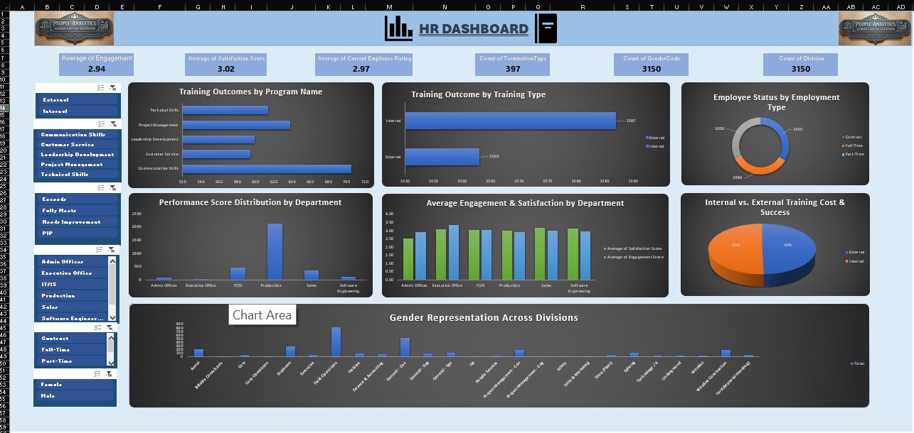

# HR Data Analytics: End-to-End Data Cleaning & Interactive Dashboard

"Transformed a messy HR dataset into an interactive analytics dashboard. Cleaned raw data, defined key workforce KPIs, analyzed trends using pivot tables, and built a dynamic dashboard for HR insights."

---

## 📌 Project Workflow & Methodology

Maine is project ko **4 major phases** mein complete kiya hai. Niche har step ki detail di gayi hai:

### 📥 Phase 1: Raw & Messy Data Assessment
Shuruat mein data kafi unorganized aur messy tha, jisme analysis karna mumkin nahi tha.
* **Problem:** Data mein duplicate entries thin, blanks/missing values thin, aur formats galat the.

---

### 🧹 Phase 2: Data Cleaning & Transformation (The Process)
Data ki accuracy barkarar rakhne ke liye maine niche diye gaye data cleaning steps perform kiye:
1. **Removing Duplicates:** Sabse pehle unique employee IDs ke basis par duplicate records ko delete kiya.
2. **Handling Missing Values:** Blanks aur missing cells ko business logic ke hissab se treat kiya (ya toh drop kiya ya mean/mode se fill kiya).
3. **Data Type Correction:** Dates ko proper date format mein aur text columns ko proper casing (Upper/Lower case) mein standardize kiya.
4. **Conditional Columns:** Kuch naye columns banaye (jaise Age Group ya Tenure Buckets) taaki segmentation asan ho sake.

---

### 📊 Phase 3: Data Analysis & KPI Formulation
Clean data milne ke baad, maine **Pivot Tables** aur formulas ka use karke business ke liye zaroori metrics aur trends ko analyze kiya:
* **Key Performance Indicators (KPIs) Defined:**
  * **Total Headcount:** Org mein total active employees kitne hain.
  * **Attrition Rate (%):** Kitne percent log company chhod kar gaye.
  * **Average Salary:** Department-wise aur gender-wise average compensation kya hai.
  * **Satisfaction Score:** Employees ka average job satisfaction level.
* **Deep-Dive Trends:** Pivot tables ki madad se department-wise attrition aur performance ratings ke correlation ko check kiya.

---

### 📉 Phase 4: Interactive Dashboard & Insights
Final step mein, saari numeric findings ko ek visually appealing dashboard mein convert kiya taaki HR management asani se decisions le sake.
* **Features:** Dynamic Slicers lagaye (e.g., Department, Gender, Job Role) taaki dashboard par click karte hi poora data filter ho jaye.
* **Visuals Used:** Bar charts, Donut charts, aur KPI Cards ka combination use kiya.

---

## 💡 Key Insights from the Project
* **High Attrition:** Kis department mein sabse zyada log company chhod rahe hain, uska pata chala.
* **Demographics:** Workforce ka gender balance aur age distribution clear dikh raha hai.
* **Salary Equity:** Departments ke beech salary distribution ka trend analyze kiya gaya.

## 🛠️ Tools Used
* **Data Cleaning & Analysis:** Microsoft Excel (Advanced Formulas, Power Query / Pivot Tables)
* **Visualization:** Excel Dashboards / Power BI 
